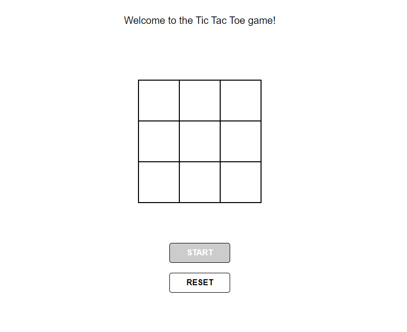

# Tic-Tac-Toe-JS

> Traditional Tic Tac Toe game

The purpose of building this project was to learn about factory functions and the module pattern

## Built With

- Javascript,
- HTML,
- CSS

## Live Demo

[Live Demo Link](https://ashah15.github.io/Tic-Tac-Toe-JS/.)

### Setup
Clone or download the repository to your local machine.

### Install
None required

## Authors

👤 Asha Abdullahi

- Github: [@Ashah15](https://github.com/Ashah15)
- Twitter: [@AshaAbdullahi13](https://twitter.com/AshaAbdullahi13)
- Linkedin: [Asha Abdullahi](https://www.linkedin.com/in/ashaabdullahi/)

👤 Julian Blasco

- Github: [@Blasco9](https://github.com/Blasco9 )
- Twitter: [@julianblasco9](https://twitter.com/julianblasco9)
- Linkedin: [Julian Blasco](https://www.linkedin.com/in/julian-blasco/ )

## 🤝 Contributing

Contributions, issues and feature requests are welcome!

Feel free to check the [issues page](issues/).

## Show your support

Give a ⭐️ if you like this project!

## Acknowledgments

- Hat tip to anyone whose code was used
- Inspiration
- etc

## 📝 License

This project is [MIT](lic.url) licensed.
